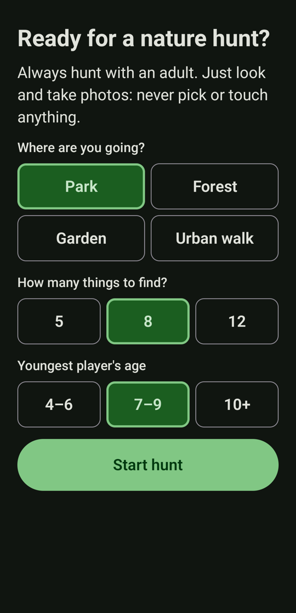
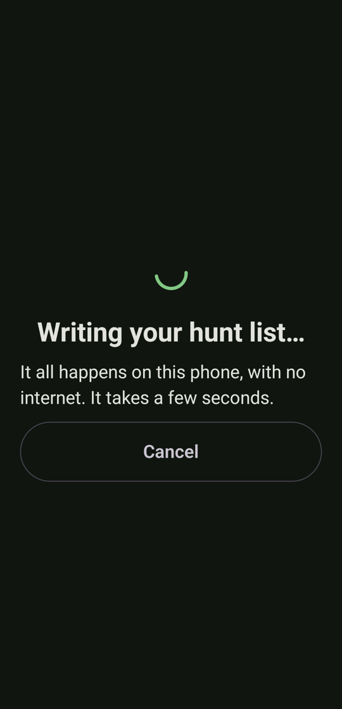
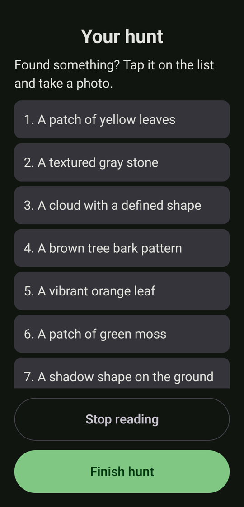
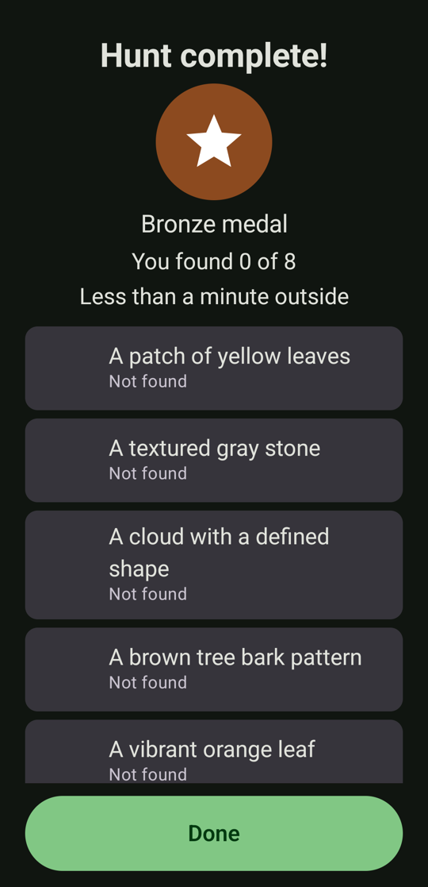
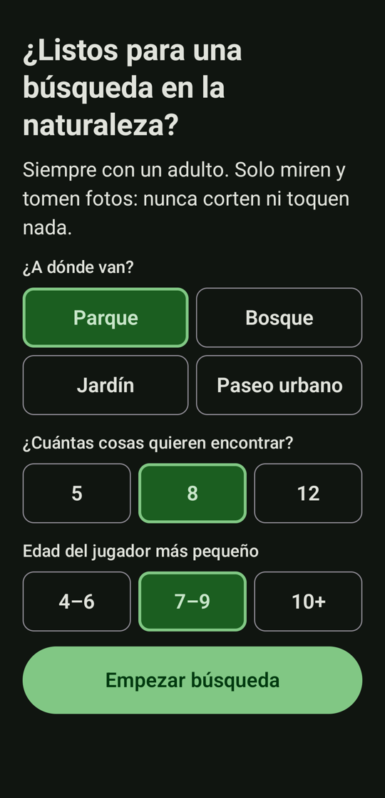
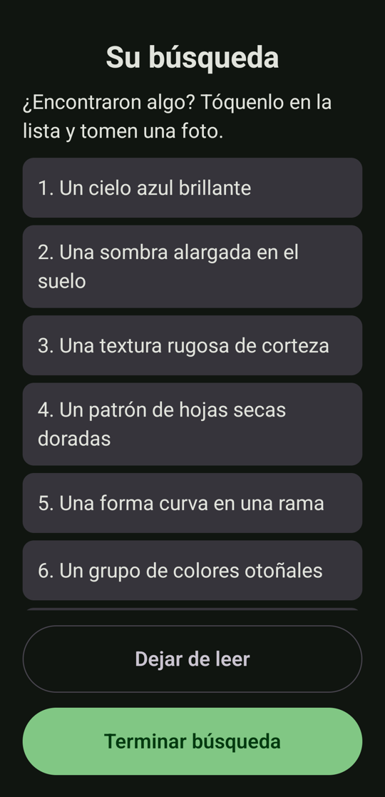
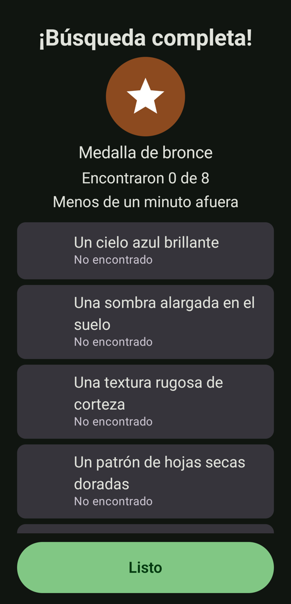
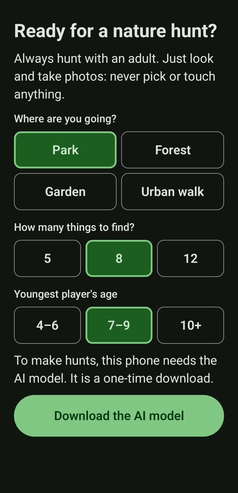
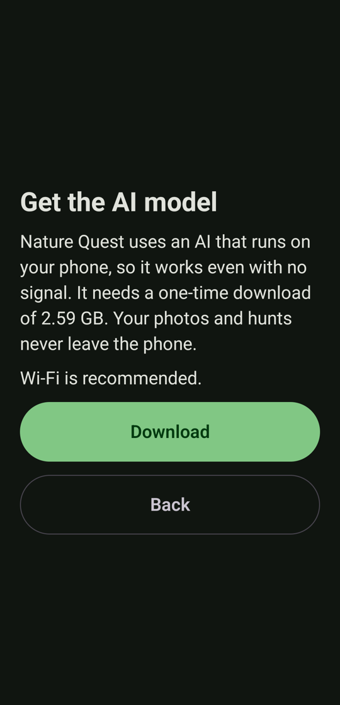
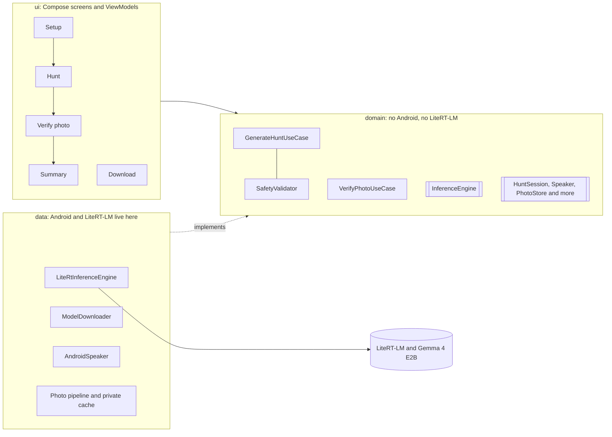

# Nature Quest

**An offline nature scavenger hunt for families and kids. The AI runs on the phone; the fun happens outside.**

Nature Quest is an Android app. You pick a place (park, forest, garden, urban walk), how many things to find, and
the age of the youngest player. An open-source AI model **running on the phone** writes a hunt list ("a red leaf",
"something with a spiral shape", "bark with moss on it"), reads it aloud, and invites everyone to put the phone away.
When someone finds something they take **one photo**; the same on-device model checks it, answers with a short,
encouraging message (also read aloud) and gives a friendly hint if it is not a match. At the end there is a bronze,
silver or gold medal and the time spent outside.

The phone is a tool for a few seconds at a time. The screen is the shortest part of the experience.

Built for the **DEV Hacktoberfest Open-Source AI Challenge, Week 1: "Touch Grass"**.

<table>
  <tr>
    <td></td>
    <td></td>
    <td></td>
    <td></td>
  </tr>
  <tr>
    <td align="center">Three choices, one tap</td>
    <td align="center">The AI writes the hunt on the phone</td>
    <td align="center">Tap what you found, take a photo</td>
    <td align="center">Medal and time outside</td>
  </tr>
</table>

## Who it is for

Families and kids on a walk, with an adult. The UI is made to be used in a few seconds: big tap targets, a high-contrast
palette for sunlight, one main action per screen, and everything is read aloud so nobody has to look at the phone.
It is in **English and Spanish** (see [Languages](#languages)).

## Languages

Nature Quest is fully available in **English** (the default) and **Spanish**. The language covers everything the player
meets: the screens, the hunt items the AI writes, its feedback and hints, the voice that reads them aloud, and the safety
check that screens the items.

- It follows the phone's language. On **Android 13 or newer** you can also set it for this app only: *Settings > System >
  Languages > App languages > Nature Quest* (English or Español). On Android 12 it follows the phone's language.
- A phone set to any **other language gets the English app**, with English hunts and an English voice, so the screens, the AI and
  the safety check always agree.

<table>
  <tr>
    <td></td>
    <td></td>
    <td></td>
  </tr>
  <tr>
    <td align="center">Inicio</td>
    <td align="center">La búsqueda, escrita por la IA</td>
    <td align="center">Medalla y tiempo afuera</td>
  </tr>
</table>

Adding another language means translating the strings and fallback hunt items, adding prompt examples and safety word lists
for it, and listing it in `res/xml/locales_config.xml`; a test fails if those lists disagree.

## How it works

1. **Setup** (under 30 seconds): place, 5 / 8 / 12 items, age range. The month and the device language are used automatically.
2. **Hunt list:** Gemma 4 writes items suited to the place, the season (central Mexico in October) and the age. Every
   item then goes through a safety check in code (see [Safety](#safety)). The list is read aloud.
3. **Found something?** Tap the item, take one photo. The photo is shrunk in memory and Gemma 4 answers "does this show X?".
4. **Feedback:** a short fun message, a hint if it was not a match, both read aloud. A match checks the item off.
5. **End of hunt:** finish any time (or find everything) to get the medal, the time outside and your photos. Photos are
   deleted unless you tap **Save to gallery**.

## Install

> **Requirements:** Android 12 or newer, a 64-bit ARM phone. The model needs about 2.6 GB of storage and 2.2 to 2.6 GB of
> RAM while it works. It was **tested on one phone, a Pixel 10 (Android 16)**; other phones are untested.

1. Download the APK from the [latest release](https://github.com/RZEROSTERN/hacktoberfest-week2/releases/latest) and open it
   (Android will ask you to allow installing from your browser or file manager).
2. Open Nature Quest. On first launch it offers **Download the AI model** (2.59 GB, **Wi-Fi recommended**; the app warns you
   on a metered connection). Progress is shown, an interrupted download continues where it stopped, and the file is checked
   with a SHA-256 before it is used.
3. That is the only time the app uses the internet. After that it works with no signal.

<table>
  <tr>
    <td></td>
    <td></td>
  </tr>
  <tr>
    <td align="center">Until the model is on the phone, Setup offers to download it</td>
    <td align="center">One-time download: size, Wi-Fi advice, progress and resume</td>
  </tr>
</table>

**For developers:** skip the in-app download by pushing the model yourself. Get `gemma-4-E2B-it.litertlm` from
[litert-community/gemma-4-E2B-it-litert-lm](https://huggingface.co/litert-community/gemma-4-E2B-it-litert-lm) (public, no
token needed) and, with the debug build installed:

```bash
adb push gemma-4-E2B-it.litertlm /data/local/tmp/ && adb shell "run-as mx.dev1.naturequest sh -c 'mkdir -p files && cp /data/local/tmp/gemma-4-E2B-it.litertlm files/'" && adb shell rm /data/local/tmp/gemma-4-E2B-it.litertlm
```

## Build from source

You need JDK 17+, the Android SDK with platform 37, and a phone (the model does not run on emulators).

```bash
./gradlew assembleDebug lintDebug testDebugUnitTest   # build, lint and 148 unit tests
./gradlew installDebug                                  # install on the connected phone
```

## Why open source matters here

- **It works with no signal on the trail.** After the one-time model download there is no server to reach. Hunts, photo
  checks and read-aloud all run on the phone.
- **Kids' photos never leave the phone.** A closed cloud model would mean sending children's photos to someone else's
  server. Here the photo is processed in memory, only a small copy is kept in private cache until the summary, and the only
  code in the app that opens a network connection is the model downloader. You can check that: the manifest asks for
  `CAMERA`, `INTERNET` (used only for the download) and the network state (to warn about metered connections).
- **Zero cost per hunt.** There is no API bill, so a school, a scout group or a family can use it as much as they like. The
  cost is the phone's time and battery: roughly 5 to 12 seconds per hunt list and 5 to 7 seconds per photo check.
- **The model is swappable.** The AI is a file plus a pinned entry in `ModelSpec` (URL, size, SHA-256), and the app only talks to
  it through an `InferenceEngine` interface. Switching to another `.litertlm` model means changing that entry and the prompts.
  (Only Gemma 4 E2B has been tried.)

## Architecture

Single Android module in Kotlin with Jetpack Compose, MVVM and Clean Architecture, Hilt, Coroutines and Flow, CameraX and
Android's TextToSpeech. Dependencies point inward: `ui` and `data` depend on `domain`, never the other way round.



- **`InferenceEngine`** is the only seam to the model. ViewModels and use cases never touch LiteRT-LM, so unit tests use a fake.
- **Strict JSON** from the model is parsed with kotlinx.serialization; invalid output is retried once and then replaced by a
  safe default ("I'm not sure, try another photo", or a built-in hunt list).
- **Prompts** are versioned files in `app/src/main/assets/prompts/`, never inline in Kotlin.
- **Decisions** are logged with their reasons in [`docs/DECISIONS.md`](docs/DECISIONS.md) (32 entries).

### What the spike taught us

The numbers below are from a Pixel 10; see [`docs/BENCHMARKS.md`](docs/BENCHMARKS.md) for the full tables and caveats.

| | Result |
|---|---|
| Model load | 3.1 s the first time, about 0.5 s afterwards (CPU) |
| Hunt list (5 to 12 items) | 4.6 to 7.4 s on a cool phone; up to 11.9 s after many back-to-back runs |
| Photo check | 4.5 to 5 s cool, 5.7 to 6.5 s when the phone is slow (140 visual tokens, 640 px photo) |
| Peak memory (CPU) | 2.2 to 2.6 GB, fully freed when the model is released |
| First-launch download | about 20 MB/s on Wi-Fi, so roughly 2 minutes, plus 5 s to verify |

Surprises that shaped the design: the **CPU backend was about twice as fast as the GPU** on this phone; decoding is slow
(about 7 to 23 tokens per second), so every answer is kept short; the phone slows down about 1.6x under sustained load,
so defaults were chosen to meet the targets in that state.

### Safety

The prompt asks for safe items, but the model cannot be trusted with safety: during testing it produced "a coiled snake",
"orange fungus", "a bird's nest hidden in a hollow" and "a cloud shaped like a deer". So safety is **enforced in code**:
every item must pass a deterministic English and Spanish validator (no picking or touching, no animals, insects or
mushrooms, nothing near water or roads, no climbing or leaving the path, nothing to eat, no photos of people). Rejected
items are regenerated and, if needed, replaced from a built-in safe list. The model's feedback text is checked too, because
it is read aloud to children. The first screen always says: hunt with an adult, only look and take photos.

### Privacy

- Photos are processed in memory and never uploaded. A small copy of each found photo is kept in app-private cache only for
  the summary and deleted when you close it (or leave the hunt, or restart the app) unless you tap **Save to gallery**.
- No analytics, no telemetry, no accounts. Backups and device transfer are disabled for the app's data.
- Reading aloud uses the phone's own speech engine, preferring an offline voice. If the phone has no voice for its language,
  the app stays silent and everything is still on screen.

## Branching model

GitFlow with **`master`** as the production branch (there is no `main`) and non-stacked pull requests:

| Branch | Purpose |
|---|---|
| `master` | Production only. Changes arrive through `release/*` or `hotfix/*` pull requests. |
| `develop` | Integration. Changes arrive only through `feature/*` pull requests. |
| `feature/<name>` | One per build step, always cut from the latest `develop`, one PR into `develop`. |
| `release/<version>` | Cut from `develop`; PR into `master`, then merged back into `develop`. |
| `hotfix/<name>` | Cut from `master` for urgent fixes; PR into `master`, merged back into `develop`. |

No branch is ever created from another feature branch. Every step (scaffold, project memory, model spike, hunt generation,
photo verification, game loop, model download, README) was its own branch and pull request.

## Status and known limits

Being honest about what has and has not been checked:

- **Photo-check accuracy has not been measured.** The pipeline is verified end to end on a phone, but there was no set of
  real photos to score the model against. Treat the verdicts as "fun and encouraging", not as a reliable judge.
- Tested on **one phone** (Pixel 10). Speed, memory and the speech voice will differ elsewhere.
- Spanish and English both ran on the device; Spanish got more testing. Other languages fall back to English (checked on the device with the app set to French).
- The history of past hunts (a stretch goal) was not built.

## Built with

Kotlin, Jetpack Compose, Hilt, CameraX, LiteRT-LM ([Apache-2.0](https://github.com/google-ai-edge/LiteRT-LM)) and Gemma 4 E2B
(Apache-2.0 per its [model card](https://huggingface.co/litert-community/gemma-4-E2B-it-litert-lm)). The app was developed
with Claude Code as a pair-programmer; **no closed model is used at runtime**.

## License

[MIT](LICENSE), plus a Beerware clause: if we meet some day and you think this is worth it, you can buy the author a beer.
